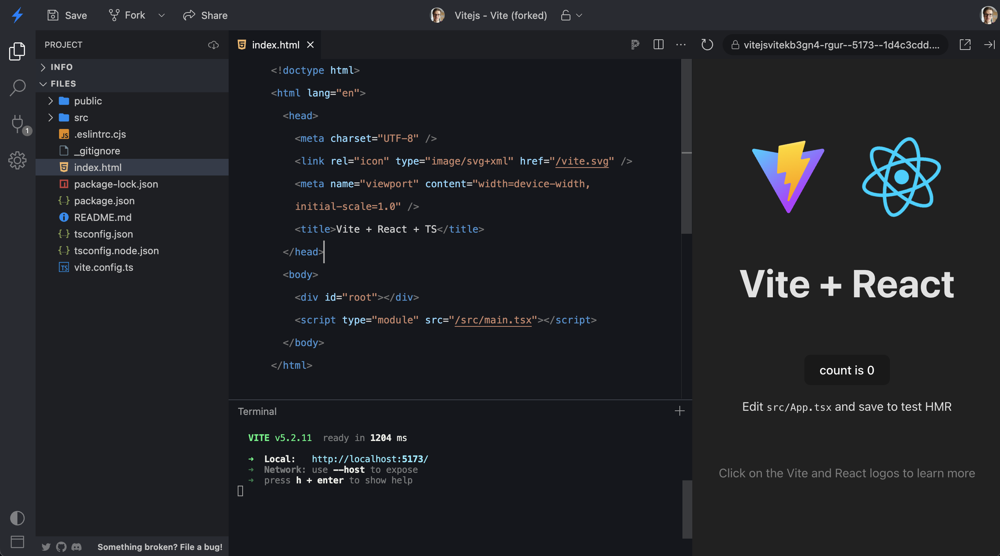
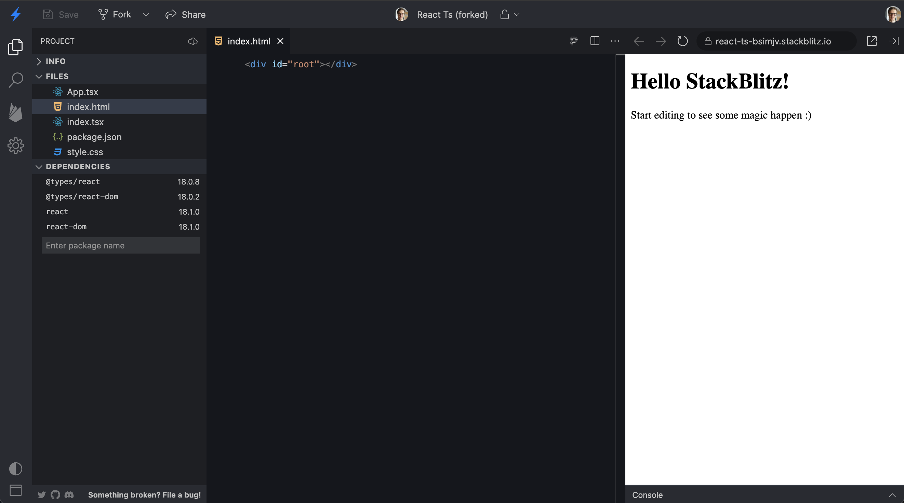
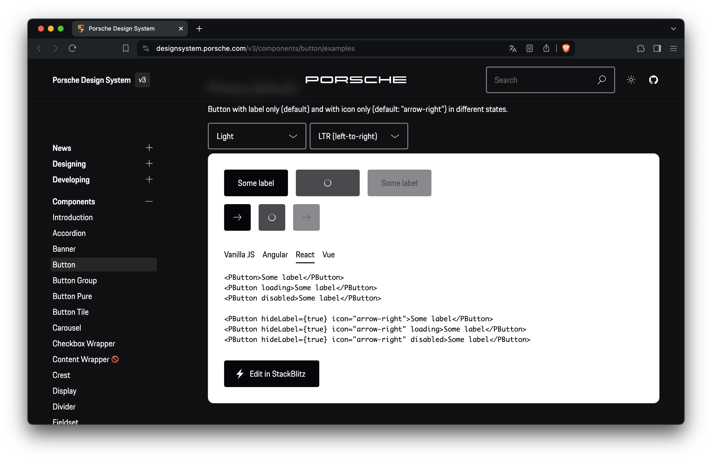
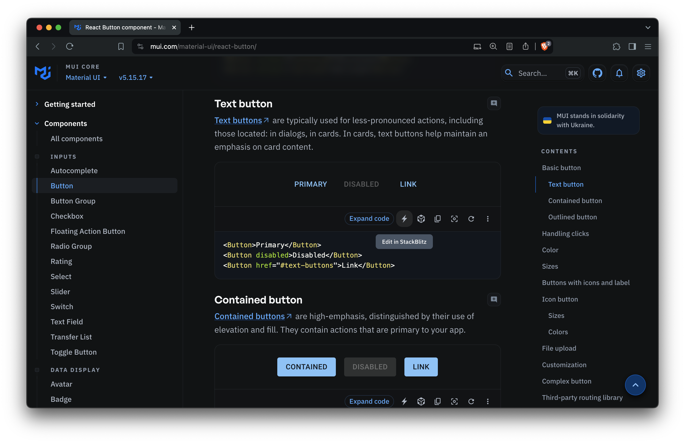
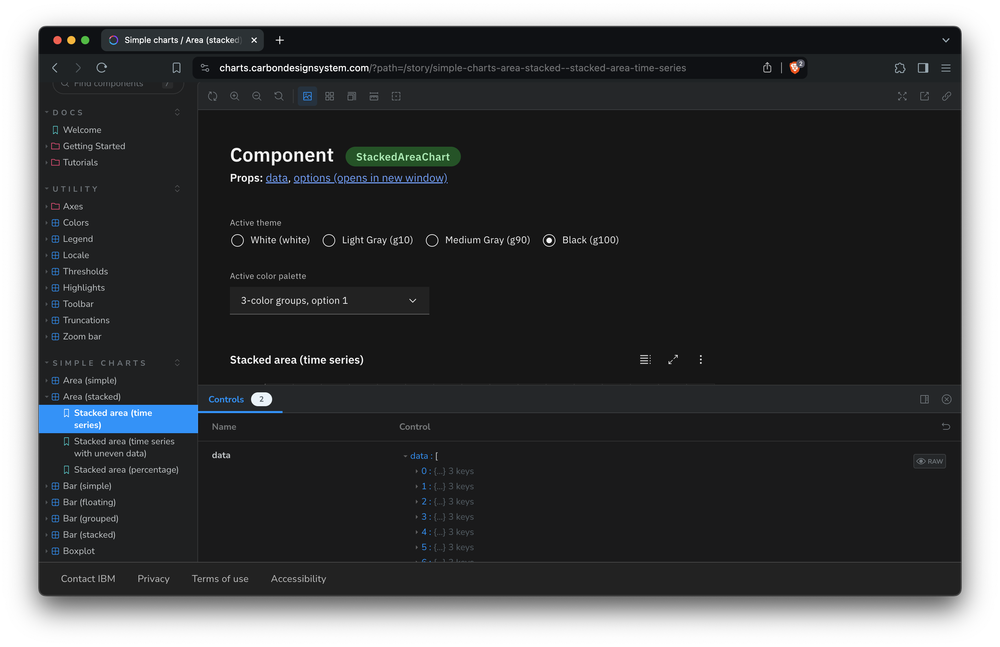
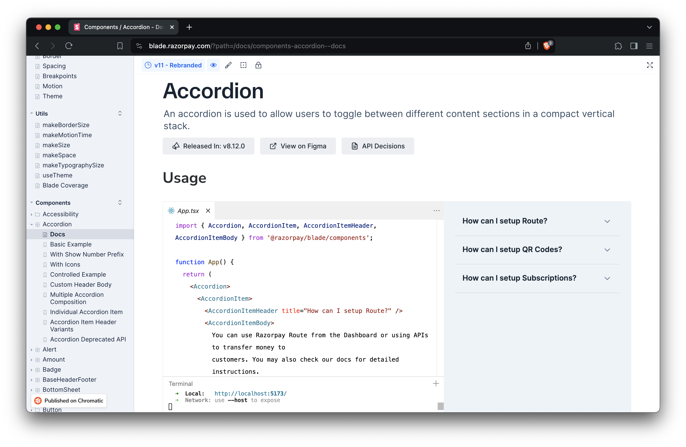
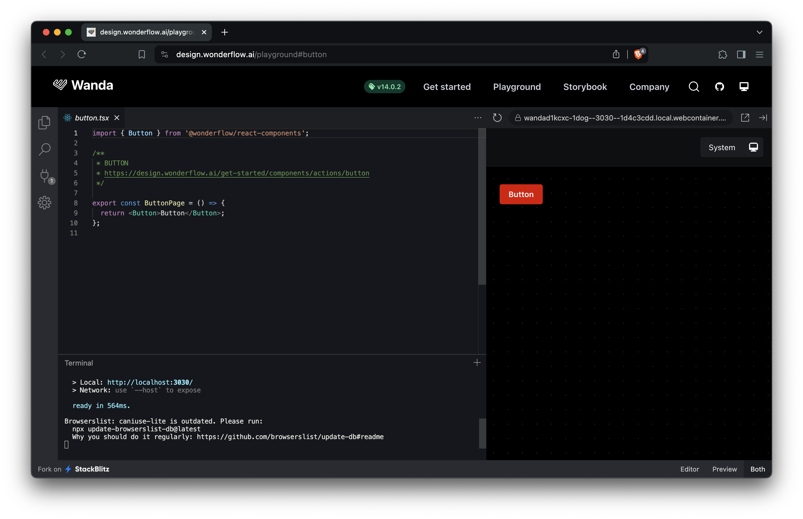

#

---
hideInToc: true
title: Table of contents
---

# Frontend Documentation:<br> Cutting-Edge Tools with StackBlitz


---
title: Intro
---

<Header></Header>

<Row class="gap-8">
  

  <div>

  ## 👋 Hi, I'm Tomek!

  <div class="ml-10">
  
  DevRel and Founding Enginer at StackBlitz.
  - Passionate about dev education & DevExperience
  - also: tools in general & music instruments
  - [twitter.com/sulco](https://twitter.com/sulco)
  </div>
  </div>
</Row>


---
title: What is StackBlitz?
---

::Header{chapter="But first"}
  What is StackBlitz?
::

<Row class="mt-12">
  
  
</Row>

---

### Types of docs


---
title: "Docs: API reference"
---

### Types of docs
# Reference
  ::row
    [](https://microsoft.github.io/monaco-editor/docs.html)
    [](https://rxjs.dev/api/index/function/fromEvent)
  ::


---
title: "Docs: Isolated topic pages"
image: "/images/angular-binding-syntax.png"
link: "https://angular.io/guide/binding-syntax"
---

### Types of docs
# Explanation

---
title: "Docs: Cross-topic guides"
image: "/images/nuxt-routing.png"
link: https://nuxt.com/docs/getting-started/routing
---

### Types of docs
# How-to Guides

---
title: "Docs: Tutorials"
---

### Types of docs
# Tutorials

::row
[](https://nextjs.org/learn-pages-router/basics/create-nextjs-app/setup)
[](https://learn.svelte.dev/tutorial/named-form-actions)
::

---
title: Where's the value? (1 – shadcn)
---

### Why do it?

# The value of interactive

::iframe{src="https://ui.shadcn.com/docs/components/badge#outline" .h-120 .-mt-12 .scale-75}
::

---
title: Where's the value? (2 – shadcn interactive)
---

### Why do it?

# The value of interactive

::iframe{src="https://stackblitz.com/edit/vitejs-vite-h14tdb?embed=1&file=src%2FApp.tsx" .h-120 .-mt-12 .scale-75}
::


---
title: Where's the value? (3 – porsche)
---

### The value of interactive [🔗](https://designsystem.porsche.com/v3/components/button/examples){.absolute .right-0}

::iframe{src="https://designsystem.porsche.com/v3/components/button/examples" .h-140 .-mt-1 .scale-90}
::

---
title: Where's the value? (4 – summary)
---

### Why do it?

# The value of interactive

- Developer experience [↑]{.text-green}
::v-clicks{.h-100}
- Support requests [↓]{.text-red}
- Bug reports quality [↑]{.text-green}
- Adoption [↑]{.text-green}
::

---
title: "The tools [cover]"
---
# The tools

---
title: Getting code into StackBlitz
---

::Header{chapter="But first"}
  Getting code into StackBlitz
::

<br>

- Making a StackBlitz project
  <br>
- Using the StackBlitz GitHub Importer
  <a href="https://stackblitz.com/github/remix-run/react-router/tree/main/examples/basic" target="_blank">
    
  </a><br>
- <span>Utilizing the StackBlitz SDK</span>


---

# GitHub Importer

::v-click
- "static" – source code is used _as is_
- zero setup, no dependencies
- use as a link to a new tab, or embedded

<div class="flex gap-6 mt-12">
  
  
</div>

---
title: "GitHub Importer: What to load?"
---

### GitHub Importer

# **What** to load?

<code class="important:(p-3 font-size-4.5 my-10) inline-flex">
  https://stackblitz.com/<span v-mark.yellow>github/remix-run/react-router</span>/<span v-mark.green="{at: 3}">tree/main</span>/<span v-mark.blue="{at: 2}">examples/basic</span>
</code>

- <span v-mark.underline.yellow="{at: 1, strokeWidth: 1}">repository</span>
- <span v-mark.underline.blue="{at: 2, strokeWidth: 1}">nested path</span>
- <span v-mark.underline.green="{at: 3, strokeWidth: 1}">branch</span>
- tag
- commit

---
title: "GitHub Importer: How to load it?"
---

### GitHub Importer

# **How** to load it?

<code class="important:(p-3 font-size-4 my-10) inline-flex">
  <span class="opacity-50">https://stackblitz.com/.../basic</span>
  ?<span v-mark.yellow>title=<span class="opacity-60">Table%20Sorting%Example</span></span>
  &<span v-mark.blue>file=<span class="opacity-60">main.tsx,makeData.ts</span></span>
</code>


<ul class="float-left">
  <li><span v-mark.underline.yellow="{at: 1, strokeWidth: 1}">title</span></li>
  <li><span v-mark.underline.blue="{at: 2, strokeWidth: 1}">file(s) to open</span></li>
  <li>npm script to autorun</li>
  <li>and more!</li>
</ul>


---
title: "GitHub importer: Let's try it"
---

::Header{chapter="GitHub Importer"}
  Let's try it
::

<code class="important:(p-3 font-size-4.5 my-10) inline-flex">
  https://github.com/remix-run/react-router
</code>

---
title: "GitHub importer: Pro tips"
---

### GitHub Importer
# Pro tip:

"Getting Started" & reproduction templates

[<figure><figcaption>stackblitz.new</figcaption></figure>](https://stackblitz.new)

---
title: "StackBlitz SDK: assemble your code"
---

::Header{chapter="StackBlitz SDK"}
  Use cases
::

::v-click{at=1}
- "static" 
- or [just-in-time assembly]{v-mark=2} of the code

---
title: StackBlitz SDK 101
---

::Header{chapter="StackBlitz SDK"}
  Capabilities
::

1. Opening a coding environment (two options)
1. Sourcing the code
1. Configuring the look & feel
1. Modifying it

---
title: "1: Coding Environments: WebContainers"
---

::Header{chapter="1: Coding Environments"}
  WebContainers
::

<Row class="gap-6 mt-24 flex-items-start">
<div class="w-70%">
  
</div>

<div class="w-30%">

"template": 
  - `node`

</div>
</Row>

---
title: "1: Coding Environments: EngineBlock"
---

::Header{chapter="1: Coding Environments"}
  EngineBlock
::

<Row class="gap-6 mt-24 flex-items-start">
<div class="w-70%">
  
</div>

<div class="w-30%">

"template": 
  - `create-react-app`
  - `angular-cli`, 
  - `javascript`, 
  - `vue` 
  - `html`
  - `polymer`

</div>
</Row>

---
title: "1: Opening or embedding"
---

::Header{chapter="1: Coding Environments"}
  Starting the environment
::

<Row class="gap-15">

<div v-click>

### `"open"`
New page, full-window editor.

```ts
sdk.openProject(...
```
</div>

<div v-click>

### `"embed"`
Current page, access to the environment using the <code v-mark.box.orange="{at: 3}" class="m-2">vm</code> object.

```ts
const vm = await sdk.embedProject('embedElementId', ...
```
</div>
</Row>

---
title: "2: Sourcing the code"
---

::Header{chapter="2: Sourcing the code"}
  Getting the files for the editor
::

<div class="flex flex-col gap-6 mt-24">

<v-clicks>

```ts
// dynamic code, defined just-in-time
sdk.openProject({
  files: {
    'index.html': `<div id="app"></div>`,
    'index.js': `const appDiv = document.getElementById('app');`
    ...
```

```ts
// loading a repository (branch, tag, commit)
sdk.openGithubProject('username/repository-name', ...
```

```ts
// loading project stackblitz.com project using a slug
sdk.openProjectId('vitejs-vite-4b9phy', ...
```
</v-clicks>

</div>

---
title: "3: Configuring the look & feel"
---

::Header{chapter="3: Configuring"}
  Customizing the IDE
::

<table class="text-sm mt-28">
  <tr>
    <td><code>clickToLoad</code></td>
    <td>Shows a UI dialog asking users to run the project.</td>
  </tr>
  <tr>
    <td><code>hideExplorer</code></td>
    <td>
      Hides the ActivityBar.
    </td>
  </tr>
  <tr>
    <td><code>newWindow</code></td>
    <td>Opens the project in a new tab.</td>
  </tr>
  <tr>
    <td><code>openFile</code></td>
    <td>
      Specifies which file(s) to open in the editor and code lines to
      highlight.
    </td>
  </tr>
  <tr>
    <td><code>showSidebar</code></td>
    <td>
      Shows the
      <a href="https://developer.stackblitz.com/guides/user-guide/ide-whats-on-your-screen">Sidebar</a> as
      open (<code>true</code>) or closed (<code>false</code>) on page load.
    </td>
  </tr>
  <tr>
    <td><code>theme</code></td>
    <td>Sets the desired color theme.</td>
  </tr>
  <tr>
    <td><code>view</code></td>
    <td>
      Sets the initial UI view: editor, preview, or both.
    </td>
  </tr>
</table>

<p class="text-right">
  <small>more: <a href="https://developer.stackblitz.com/platform/api/javascript-sdk-options#openoptions" target="_blank">developer.stackblitz.com/platform/api/javascript-sdk-options</a></small>
</p>

---
title: "4: Modifying"
---

::Header{chapter="4: Modifying"}
  The files format
::

```ts {all|2|4-7|8}
const files = {
  'index.html': `<div id="app"></div>`,
  
  'index.js': `import './style.css';
const appDiv = document.getElementById('app');
appDiv.innerHTML = '<h1>JS Starter</h1>';`,

  'styles/style.css': `body { font-family: system-ui, sans-serif; }`,
}
```

---
title: "4: Modifying"
---

::Header{chapter="4: Modifying"}
  Updating the files
::

```ts
await vm.applyFsDiff({
  create: {
    'index.js': `console.log('Hello World!')`,
    'package.json': `{ "scripts": { "start": "node index.js" } }`,
  },
  destroy: ['test.js', 'error.log'],
});
```

---

# Examples

[](https://rxjs.dev/api)

---
title: "Examples: Porsche"
---

<a href="https://designsystem.porsche.com/v3/components/button/examples"></a>

---
title: "Examples: MUI"
---

<a href="https://mui.com/material-ui/react-button/" target="_blank"></a>

---
title: "Examples: Carbon Design (IBM)"
---

<a href="https://charts.carbondesignsystem.com/?path=/story/simple-charts-area-stacked--stacked-area-time-series" target="_blank"></a>

---
title: "Examples: Razorpay"
---

<a href="https://blade.razorpay.com/?path=/docs/components-accordion--docs" target="_blank"></a>

---
title: "Examples: Wanda Design System"
---

<a href="https://design.wonderflow.ai/playground#button" target="_blank"></a>

---

[](https://mgt.dev/?path=/story/components-mgt-person-react--person)

---
title: "WebContainer API: 101 on WebContainers"
---

# WebContainer API

## 101 on WebContainers:{v-click}
::v-click{at=1}
- The tech behind StackBlitz
- Lightweight OS in a browser tab
- <span v-mark>Bring-your-own-UI</span>

<!--
- file system access
- virtualized network layer
- git and node support
-->

---
title: "WebContainer API: Setup"
---
### WebContainer API
# Setup

```js {1|1-4|all}
import { WebContainer } from '@webcontainer/api';

// Initialize the environment
const webcontainerInstance = await WebContainer.boot();

// Load the files
await webcontainerInstance.mount(projectFiles);
```

---
title: "WebContainer API: Manipulating"
---

### WebContainer API
# Manipulating the environment

```js {1-2|1-5|1-8|all}
// readFile, writeFile, rm, readdir, mkdir
await webcontainerInstance.fs.readFile('/package.json');

// running commands
const installProcess = await webcontainerInstance.spawn('npm', ['install'])

// listening to events
webcontainerInstance.on('server-ready', (port, url) => (iframeEl.src = url));

// reading terminal output
installProcess.output.pipeTo(new WritableStream({
  write(data) {
    console.log(data);
  }
}));
```

---
title: "WebContainer API: Bring-your-own-UI"
---

### WebContainer API
# Bring-your-own-UI

::div{.float-left.mt-4.mr-12.w-48}
<h2>Code editor</h2>
<ul>
  <li>Monaco</li>
  <li>CodeMirror</li>
</ul>
::


---
title: "WebContainer API: Bring-your-own-UI"
---

### WebContainer API
# Bring-your-own-UI

::div{.float-left.mt-4.mr-12.w-48}
<h2>Terminal</h2>
<ul>
  <li>xterm.js</li>
</ul>
::


<!-- 
– xterm – used in vscode, Azure cloud shell 
- Monaco - used in vscode, StackBlitz, most other ~heavy editors
- CodeMirror - lighter, used on webcontainer.io, tutorial
-->

---